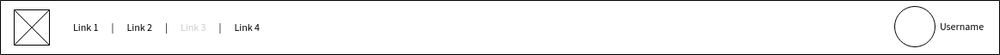

# Một vài thủ thuật CSS thu thập được từ các tiền bối FE

### 1.Grid layout, tại sao không thử ?
```html
<main class="main-container">
  <nav class="nav">Navbar</nav>
  <header class="header">Header</header>
  <article class="article">Article</article>
  <aside class="aside">Aside</aside>
  <footer class="footer">Footer</footer>
</main>
```
```css
main, nav, header, article, aside, footer {
  border: 1px solid black;
  padding: 3px;
  font-size: 20px;
  text-align: center;
}

.main-container {
  display: grid;
  grid-template-columns: 1fr 1fr 1fr 1fr;
  grid-template-rows: repeat(4, 1fr);
  grid-template-areas:
    "nav nav nav nav"
    "header header header aside"
    "article article article aside"
    "article article article aside"
    "article article article footer";
  column-gap: 5px;
  row-gap: 3px;
}

.nav {
  background-color: goldenrod;
  grid-area: nav;
}

.header {
  background-color: lightseagreen;
  grid-area: header;
}

.article {
  background-color: firebrick;
  grid-area: article;
}

.aside {
  background-color: thistle;
  grid-area: aside;
}

.footer {
  background-color: sienna;
  grid-area: footer;
}
```
Giải thích :
```css
.main-container {
  display: grid; /* khai báo dạng hiển thị là grid */
  grid-template-columns: 1fr 1fr 1fr 1fr; /* chúng ta sẽ chia 4 cột cho layout này, đây là cách thủ công */
  grid-template-rows: repeat(5, 1fr); /* Chia 5 hàng cho layout, dùng repeat để lặp nhanh hơn */
  grid-template-areas:
    "nav nav nav nav"
    "header header header aside"
    "article article article aside"
    "article article article aside"
    "article article article footer";
/* Đọc vào chúng ta cũng sẽ thấy là vị trí các Element,
 ta đã chia 4cols - 5rows vậy thì t chỉ việc sắp sếp cách nó đứng như thế nào thôi */
  column-gap: 5px; /* tương tự như margin nhưng theo chiều dọc*/
  row-gap: 3px; /* tương tự như margin nhưng theo chiều ngang*/

  /* Hoặc có thể dùng */
  grid-gap: 5px 3px
}
```
<p class="codepen" data-height="381" data-theme-id="dark" data-default-tab="css,result" data-user="th-ng-the-looper" data-slug-hash="JjbyNMJ" style="height: 381px; box-sizing: border-box; display: flex; align-items: center; justify-content: center; border: 2px solid; margin: 1em 0; padding: 1em;" data-pen-title="LayoutGrid">
  <span>See the Pen <a href="https://codepen.io/th-ng-the-looper/pen/JjbyNMJ">
  LayoutGrid</a> by Thươ Ng (<a href="https://codepen.io/th-ng-the-looper">@th-ng-the-looper</a>)
  on <a href="https://codepen.io">CodePen</a>.</span>
</p>
<script async src="https://cpwebassets.codepen.io/assets/embed/ei.js"></script>

### 2. Selector :not()
Để xử lý 1 item cuối khác với css còn lại, bạn thường làm như vậy :
```css
.nav-item {
  border-right: 1px solid black;
}
.nav-item:last-child {
  border-right: 0;
}
```
Mình cũng có thể dùng như này để giảm code mà vẫn có UI mong muốn : 
```css
.nav-item:not(:last-child) {
  border-right: 1px solid black;
}
```

### 3. Flexbox với margin-left: auto
Giả sử ta có 1 layout thường gặp như sau:


Khi sử dụng Flexbox để xử lý layout trên, hay thấy mọi người code kiểu này:
```html
<header>
	<div>
		<div class="logo"></div>
		<div class="menu"></div>
	</div>
	<div class="user"></div>
</header>
```
```css
header {
    display: flex;
    justify-content: space-between;
}
```
Nhưng với thuộc tính margin-left: auto, mọi người có thể giản lược đi 1 thẻ div không cần thiết, code sẽ được viết lại như sau:
```html
<header>
	<div class="logo"></div>
	<div class="menu"></div>
	<div class="user"></div>
</header>
```
```css
header {
    display: flex;
}
.user {
    margin-left: auto;
}
```

### 4. Kết hợp CSS cho các phần tử
Khi bạn viết CSS nhiều lúc sẽ bị bỏ sót những phần tử ngang hàng, có thuộc tính giống nhau. Nhưng chúng lại phải viết đi viết lại dòng CSS và định nghĩa thuộc tính cho những phần tử đó. 
```css
h1{ font-family:Arial, Helvetica, sans-serif; font-weight:normal; }
h2{ font-family:Arial, Helvetica, sans-serif; font-weight:normal; }
h3{ font-family:Arial, Helvetica, sans-serif; font-weight:normal; }
```

```css
h1, h2, h3{ font-family:Arial, Helvetica, sans-serif; font-weight:normal; }
```

### 5. Căn giữa theo chiều dọc nội dung
 Vấn đề: Giữ một phần tử HTML (với chiều cao không xác định) được căn giữa theo chiều dọc bên trong phần tử khác
Quá đơn giản với Flexbox và justify-content:center;
Hoặc : 
<p class="codepen" data-height="265" data-theme-id="dark" data-default-tab="css,result" data-user="th-ng-the-looper" data-slug-hash="MWbvmpY" style="height: 265px; box-sizing: border-box; display: flex; align-items: center; justify-content: center; border: 2px solid; margin: 1em 0; padding: 1em;" data-pen-title="cangiuacss">
  <span>See the Pen <a href="https://codepen.io/th-ng-the-looper/pen/MWbvmpY">
  cangiuacss</a> by Thươ Ng (<a href="https://codepen.io/th-ng-the-looper">@th-ng-the-looper</a>)
  on <a href="https://codepen.io">CodePen</a>.</span>
</p>
<script async src="https://cpwebassets.codepen.io/assets/embed/ei.js"></script>

### 6. Night Mode
Vấn đề: Thực hiện chế độ ban đêm nhanh.
Dùng filter css để đảo ngược chế độ màu.
<p class="codepen" data-height="265" data-theme-id="dark" data-default-tab="html,result" data-user="th-ng-the-looper" data-slug-hash="rNWzmmx" style="height: 265px; box-sizing: border-box; display: flex; align-items: center; justify-content: center; border: 2px solid; margin: 1em 0; padding: 1em;" data-pen-title="filtercss">
  <span>See the Pen <a href="https://codepen.io/th-ng-the-looper/pen/rNWzmmx">
  filtercss</a> by Thươ Ng (<a href="https://codepen.io/th-ng-the-looper">@th-ng-the-looper</a>)
  on <a href="https://codepen.io">CodePen</a>.</span>
</p>
<script async src="https://cpwebassets.codepen.io/assets/embed/ei.js"></script>


### 7. Căn giữa đối tượng theo chiều dọc/ngang khi đang có position
```css
div#content {
  position: relative;
  top: 50%;
  transform: translateY(-50%);
}
```
Tại sao ư ? Nhìn đây :

```
        TOP: 0px;                     TOP: 50%;          TOP:50%;transform: translateY(-50%);
--------Top of Page--------   --------Top of Page--------   --------Top of Page--------
{element}

------Middle of  Page------   ------Middle of  Page------   {element}-Middle of Page---
                              {element}


------Bottom of  Page------   ------Bottom of  Page------   ------Bottom of  Page------
```
Tương tự với chiều ngang ta có 
```css
div#content {
  position: relative;
  left: 50%;
  transform: translateX(-50%);
}
```

### 8. Tips code css

1. Có những selector nó là luôn đúng rồi, nên bạn không cần viết thêm những thẻ thừa, selectors của bạn đảm bảo không sai.
```css
/* bad */
img[src$=svg], ul > li:first-child {
  opacity: 0;
}

/* good */
[src$=svg], ul > :first-child {
  opacity: 0;
}
```
* Thuộc tính src chỉ tồn tại duy nhất trong thẻ img mà thôi.
* Cấu trúc chuẩn HTML thì thẻ con trực tiếp của ul phải luôn là li, nếu mà CSS ở trên chọn sai

2. Đổi value sang kiểu Tiếng Anh, thì code đọc vào là hiểu ngay liền à!
```css
/* bad */
:nth-child(2n + 1) {
  transform: rotate(360deg);
}

/* good */
:nth-child(odd) {
  transform: rotate(1turn);
}
```
* Thay 2n + 1 bằng odd, odd là đề cập đến các phần tử con có thứ tự lẻ như 1, 3, 5. Bên cạnh đó thì có even là thứ tự chẵn như 2, 4, 6.
* Thay 360deg bằng 1turn (1 vòng).

4. Style cho các liên kết: 
```css
a:link{}
a:visited{}
a:hover{}
a:active{}
```
5. Html hack cho IE
```css
.element {
    background: red; /* các trình duyệt hiện đại */
    *background: green; /* IE7 và các phiên bản thấp hơn */
    _background: blue; /* chỉ IE6 */
}
```
6. Cắt ngắn text cho vừa với chiều rộng
```html
<p class='ellipsis'>Nội dung này quá dài nên sẽ bị cắt ngắn ^^<p>
```

```css
.ellipsis {
    overflow: hidden;
    text-overflow: ellipsis;
    white-space: nowrap;
    width: 200px;
}
```