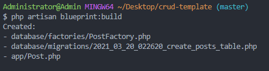
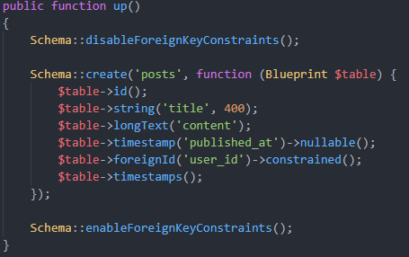
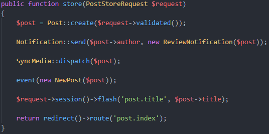
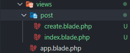

# TIPS viết code laravel nhanh hơn ở local:
## blueprint:
- Công cụ  này giúp chúng ta có thể generate các Model/Controller/View/Action nhanh hơn
- Đầu tiên chúng ta cần cài đặt nó với compoeser:
```
composer require --dev laravel-shift/blueprint
```
- Sau khi cài xong chúng ta có thể :
 ```
 php artisan vendor:publish --tag=blueprint-config
 ```
để generate các config của package:
```php
    'generators' => [
        'controller' => \Blueprint\Generators\ControllerGenerator::class,
        'factory' => \Blueprint\Generators\FactoryGenerator::class,
        'migration' => \Blueprint\Generators\MigrationGenerator::class,
        'model' => \Blueprint\Generators\ModelGenerator::class,
        'route' => \Blueprint\Generators\RouteGenerator::class,
        'seeder' => \Blueprint\Generators\SeederGenerator::class,
        'test' => \Blueprint\Generators\TestGenerator::class,
        'event' => \Blueprint\Generators\Statements\EventGenerator::class,
        'form_request' => \Blueprint\Generators\Statements\FormRequestGenerator::class,
        'job' => \Blueprint\Generators\Statements\JobGenerator::class,
        'mail' => \Blueprint\Generators\Statements\MailGenerator::class,
        'notification' => \Blueprint\Generators\Statements\NotificationGenerator::class,
        'resource' => \Blueprint\Generators\Statements\ResourceGenerator::class,
        'view' => \Blueprint\Generators\Statements\ViewGenerator::class,
    ],
```
chúng ta có thể thấy ở cuối là blueprint có thể generate hầu như những thứ t cần trong laravel. vậy bắt đầu thử nghiệm thôi nào !
### Chuẩn bị:
- Đầu tiên cần chuẩn bị 1 file draft.yaml vì khi dùng lệnh build của package,  nó sẽ tự động tìm tới file này để generate.
#### Model:
```yml
#yaml
models:
  Post:
    title: string:400
    content: longtext
    published_at: nullable timestamp
```
-> php artisan blueprint:build;

-  Chúng ta có thể thấy nó sẽ gen ra mọi thứ liên quan tới model (Model, Migrate, Factory), việc còn lại của chúng ta là đặt nó ở đâu chỉnh sửa thêm gì thì làm
### Datatype Model:
- Hầu như nó support cho ta 80% các loại datatype trong migration:
```yml
keyword: string:100 nullable index
quantity: integer/bigInteger/...
payment_token: string:40 
total: decimal:8,2
status: enum:pending,successful,failed

# cũng có các loại timestamp
deleted_at: timestamp
created_at: timestamp
updated_at: timestamp

softDeletes
timestamps
...
```
Chúng ta chỉ cần khai báo đúng kiểu dữ liệu ta muốn, nó sẽ tạo ra migration hợp lí.
### Relations
Ví dụ ta có bản POST ở trên và bản User với relation là
```php
# User
public function posts() {
    return $this->hasMany(Post::class);
}

# Post
public function creator() {
    return $this->belongsTo(User::class);
}
```
Chúng ta sẽ khai báo như sau :
```yaml
# thêm trường creator_id vào POST
  Post:
    ...
    creator_id: id foreign:users
    creator_id: id foreign:users.id
    # hoặc
    user_id: id foreign # với trường hợp này thì cần field tên là user_id
```

- Dù nó vẫn chưa trỏ tới bảng nào nhưng vẫn khai báo đc khoá ngoại là user_id, việc ocnf lại là trỏ vào bảng users.
```yaml
    Post:
        relationships:
            belongsMany: User
    
    User:
        relationships:
            hasMany: Post
```
- Ngoài ra có thể khai báo relationship như thế này, nó sẽ tự đánh khoá ngoại -> trỏ tới bảng khai báo và khai báo luôn trong model. rất tiện phải khong nào ?

### Seeder 
- Vậy có thể seed data cho nó không ? tất nhiên là có

```yml
models:
  Post:
    title: string:400
    content: longtext
    published_at: nullable timestamp

seeders: Post
```
- Phần còn lại chỉ việc để nó lo :v
## Controllers : 
- Vậy thì controller làm đưỢc gì ?
```yaml
controllers:
  Post:
    index:
      query: all
      render: post.index with:posts
    create:
      render: post.create
    store:
      validate: title, content
      save: post
      redirect: post.index
```
- Nhìn sơ sơ chắc chúng ta cũng đã hiểu phải không ?
```php

public function index() {
    $posts = Post::all();

    return view('post.index', compact('posts'));
}

public function create() {
    return view('post.create');
}

public function store(PostStoreRequest $request)
{
    $post = Post::create($request->validated());

    return redirect()->route('post.index');
}
```
- Ô có cả view, route có cả request à ? xịn dậy ? đúng vậy nó sẽ gen ra tất cả những gì được khai báo trong controller ở yaml và validate giống như mình khai báo trong Model
```yaml
    title: string:400
    content: longtext
    published_at: nullable timestamp
```
```php
public function rules()
{
    return [
        'title' => ['required', 'string', 'max:400'],
        'content' => ['required', 'string'],
    ];
}
```
Xịn chưa :))
Ngoài ra còn các action như sau :
```yaml
# nó sẽ gen ra model binding trong action và destroy nó
destroy:
    post: delete
    redirect: post.index

store:
    validate: title, content
    save: post
    send: ReviewNotification to:post.author with:post
    dispatch: SyncMedia with:post
    fire: NewPost with:post
    flash: post.title
    redirect: post.index
```
Theo như ta thấy ở hàm store thì có send, dispath, fire, flash vậy nó có nghĩa là gì ?
Sau khi gen ra nó sẽ có cấu trúc như sau :


- wow wow! xịn dậy cả notification, job, event, flash message  ư ? đúng vậy bạn khoogn nhìn nhằm đâu, nó tất cả bạn làm bây giờ là chỉ cần thêm xử lý vào các cái được gen thôi 

- À ngoài ra còn có thể query đƠn giản với nó
```yaml
query: where:title where:content order:published_at limit:5

# và có thể chỉ định data trả về
resource: user
resource: paginate:users
```
Các bạn tháy sự lợi hại của nó chưa ? chưa hết đâu, thử mở folder views lên xem nào ?


UI thiệt luôn ? có cả view nè nhưng mà nó chỉ có như thế này thôi, phần còn lại bạn tự xử nhá :v
```
{{--
    @extends('layouts.app')

    @section('content')
        post.index template
    @endsection
--}}

```
## Eager loading :
-  Có thể luôn không ? được chứ :v 
```yaml
# khi render post và kèm theo comments
render: post.show with:post,comments
``` 

## Kết
- Ngoài ra còn rất nhiều các phương thức thú vị đang chờ khám phá, tuy nó không generate đầy đủ, nhưng với nhiêu đó khi code ở local, các bạn sẽ tiết kiệm mớ thời gian với nó. hãy thử nghiệm ngay

- Packge : https://github.com/laravel-shift/blueprint